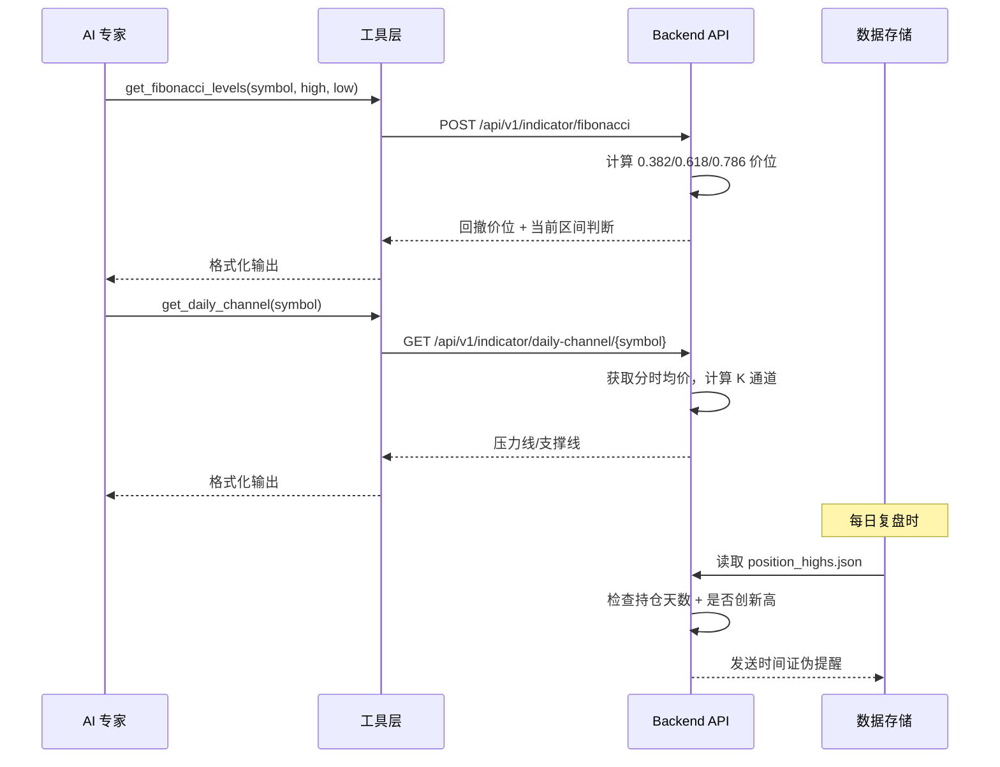

## 用户需求

将「牛股计算器」中分析出的4个有价值点全部引入 Marcus 平台：

1. **斐波那契回撤计算工具**：新增 `get_fibonacci_levels` 工具，根据阶段顶/底自动计算 0.382、0.618、0.786 三个关键回撤价位，并判断当前价格所处区间，为 AI 专家提供量化的支撑/阻力参考。

2. **日内压力支撑计算工具（K=0.98848）**：新增 `get_daily_channel` 工具，基于分时均价和 K 常数计算日内压力线（均价/K）和支撑线（均价×K），提供日内交易的精确价位参考。

3. **时间证伪退出规则**：在止损监控和每日复盘中加入「13个交易日不创新高即离场」规则，防止僵尸持仓（如东睦问题）。

4. **动态顶部自动追踪（High Water Mark）**：为每只持仓记录历史最高价和首次达到该价的日期，支持自动更新并在持仓数据中展示，让 AI 专家快速判断是否突破新高。

## 技术栈

- **后端**：Python + FastAPI，保持现有架构（无 ORM，直接 SQLite + JSON 持久化）
- **服务端工具**：TypeScript (pi-server/src/tools.ts)
- **前端工具**：TypeScript + React (ChatContainer.tsx)
- **数据持久化**：JSON 文件（high_water_marks.json）+ 现有 SQLite trades.db

## 实施方案

### 整体策略

新增一个独立的 **技术指标 API 模块** (`backend/app/api/indicator.py`)，将斐波那契和 K 值通道两个纯计算工具集中管理。时间证伪规则整合到现有止损监控器和每日复盘流程中。High Water Mark 使用 JSON 文件持久化，复用现有 `strategy_state.json` 的读写模式。

### 关键技术决策

1. **纯计算后端，无外部依赖**：斐波那契和 K 值通道都是数学计算，不依赖 Tushare/雪球等外部 API，避免 IP 封禁风险。
2. **时间证伪不依赖实时轮询**：整合到 `daily_review` 定时任务（15:00 后执行），每日检查一次，避免 30 秒轮询导致的雪球 IP 封禁。
3. **High Water Mark 用 JSON 文件**：与 `strategy_state.json` 同模式，结构简单，无需修改 SQLite schema。
4. **工具定义双重同步**：pi-server 和 frontend 各维护一份工具定义，保持现有模式。

### 架构设计



### 目录结构

```
marcus-platform/
├── backend/app/
│   ├── api/
│   │   └── indicator.py          # [NEW] 技术指标API（斐波那契回撤 + K值通道）
│   ├── models/
│   │   └── indicator.py          # [NEW] 指标响应模型（FibonacciResponse, ChannelResponse）
│   ├── services/
│   │   └── stop_loss_monitor.py  # [MODIFY] 新增时间证伪检查方法
│   │   └── scheduler_service.py  # [MODIFY] daily_review 中加入时间证伪检查
│   └── main.py                   # [MODIFY] 注册 indicator 路由
├── data/
│   └── position_highs.json       # [NEW] 持仓历史最高价追踪
├── servers/pi-server/src/
│   └── tools.ts                  # [MODIFY] 新增 getFibonacciLevelsTool + getDailyChannelTool，加入 CHAT_TOOLS/TRADE_TOOLS/REFLECT_TOOLS
├── frontend/src/components/
│   └── ChatContainer.tsx         # [MODIFY] 前端新增同名工具定义
└── core/utils/
    └── strategy_chain.py         # [MODIFY] 新增 high_water_mark 相关方法
```

## 实现细节

### 1. 斐波那契回撤工具 (`get_fibonacci_levels`)

**后端端点**: `POST /api/v1/indicator/fibonacci`

- 参数：`symbol`（必填）, `high`（可选，阶段顶部）, `low`（可选，阶段底部）
- 若未传 high/low，自动从 K 线数据中提取最近 90 天最高/最低价
- 返回：`{ f382, f618, f786, current_price, position_zone, diff }`

**位置区间判断逻辑**（复用牛股计算器逻辑）：

- now < f786 → "深坑/放弃观察"
- f786 <= now < f618*0.99 → "跌破618/弱势"
- f618*0.99 <= now <= f500*1.02 → "强防生死线"
- f500*1.02 < now <= f382*1.03 → "常规买点区域"
- now > f382*1.03 → "高位观望"

**性能**：纯数学计算，O(1)，无外部 API 调用。

### 2. 日内通道工具 (`get_daily_channel`)

**后端端点**: `GET /api/v1/indicator/daily-channel/{symbol}`

- 从腾讯行情接口获取当日分时均价（turnover/volume）
- 计算：topLine = avg / 0.98848, bottomLine = avg * 0.98848
- 返回：`{ avg_price, top_line, bottom_line, channel_width_pct }`

### 3. 时间证伪退出规则

**文件**: `backend/app/services/stop_loss_monitor.py`

- 新增 `_check_time_falsification()` 方法
- 逻辑：计算持仓自然日天数中剔除周末的交易日数，若 >= 13 且从未创新高，返回 `'时间证伪：持仓13个交易日未创新高'`

**文件**: `backend/app/services/scheduler_service.py`

- 在 `daily_review` 执行流程中增加时间证伪检查
- 读取 `position_highs.json` 判断每只持仓是否触发
- 触发时记录到日志并通过 QQ 通知用户

### 4. 动态顶部追踪（High Water Mark）

**文件**: `data/position_highs.json`（新建）

- 结构：`{ "symbol": { "high_price": float, "high_date": str, "updated_at": str } }`

**文件**: `core/utils/strategy_chain.py`

- 新增 `update_high_water_mark(symbol, current_price)` 方法
- 新增 `get_high_water_mark(symbol)` 方法
- 当日志/复盘流程中清理跨周数据

**文件**: `backend/app/api/portfolio.py`

- `get_portfolio()` 中加入 high_water_mark 数据
- 调用 `strategy_chain` 更新各持仓的最高价
- 在 `PositionResponse` 中增加 `high_water_mark` 和 `days_since_high` 字段

**文件**: `backend/app/models/account.py`

- `PositionResponse` 新增可选字段：`high_water_mark: Optional[float]`, `high_water_date: Optional[str]`, `days_since_high: Optional[int]`

## Agent Extensions

### SubAgent

- **code-explorer**
- 用途：在实现过程中验证跨文件引用关系、确保工具注册一致性
- 预期结果：确认所有新增工具在 tools.ts、ChatContainer.tsx、backend API 三处的名称/参数/调用路径完全一致