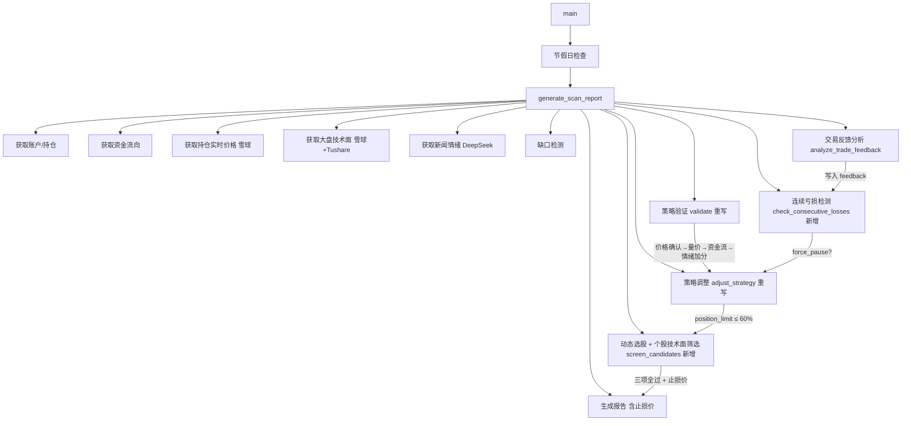

## 产品概述

将 `jobs/market_scan.py` 从"情绪优先覆盖技术面"的左侧交易逻辑，全面改造为"价格行为驱动"的右侧交易逻辑，对齐 Marcus 量化交易纪律（单日仓位 ≤ 60%、连续亏损 3 笔强制休息）。

## 核心功能

- **个股技术面筛选**：利用 tushare 日K线和 stk_factor_pro 接口，对候选股逐只检查：价格站稳 5 日均线、MACD 金叉/多头发散、成交量突破 5 日均量 1.5 倍，三项全过才入选，同时输出每只候选股的止损价位（前低或收盘价下浮 7%）
- **连续亏损强制休息**：从策略链读取历史交易，检测到连续 3 笔亏损时标记 force_pause，阻止本次扫描的新交易入场
- **仓位硬封顶 60%**：所有仓位调整逻辑中，position_limit 上限从 80% 降至 60%，严守 Marcus 铁律
- **决策链重构**：删除"情绪 ≥ 70 + 有热点 → 跳过技术面强制做多"逻辑，新决策优先级为：价格突破确认 → 量价配合 → 资金流确认 → 情绪辅助加分（+5%）
- **立场简化为 3 档**：aggressive（≤ 60%）、cautious（≤ 40%）、hold（≤ 20%），去除 reduce/cut_loss 两个低频档位
- **报告输出增强**：新增「技术面扫描」表格（代码/名称/5日线位置/MACD方向/量比/止损价）、「连续亏损状态」警告区块

## 技术栈

- Python 3（现有项目语言）
- tushare 1.4+（`pro_bar()` 获取日K线含均线，`stk_factor_pro()` 获取 MACD/RSI/BOLL 等 60+ 技术指标）
- 雪球引擎 `XueqiuEngine.get_stock_quote()`（已在用，获取实时行情）
- `StrategyChain` 策略链管理器（已在用，提供 trades/feedback_loop 状态读写）
- `core/_api_config.py`（已修复 load_dotenv，TUSHARE_TOKEN 从 .env 读取）

## 实现方法

### 整体策略

在现有 `market_scan.py` 上做就地重构，不新建文件。新增 4 个函数（数据获取 + 个股筛选 + 连续亏损检测），重写 2 个函数（策略验证 + 策略调整），修改 1 个主流程函数（generate_scan_report）。保持已有的缺口检测、节假日检查、资金流分析、持仓新闻分析等功能不变。

### 关键技术决策

**1. 技术面数据获取：tushare 直接调用而非后端 API**
`market_scan.py` 作为独立 cron 脚本运行，不经过 FastAPI 后端，因此直接 `import tushare as ts` 并调用 `ts.pro_bar()` 和 `ts.pro_api(token).stk_factor_pro()`。参考 `core/stock_pool_manager.py` 已有的 `get_tushare_pro()` 辅助函数模式，token 从 `core/_api_config.py` 的 TUSHARE_TOKEN 读取。

**2. 个股筛选：三项全过的硬过滤**

```
条件1: close > ma5（站稳5日均线）
条件2: macd_dif > macd_dea OR macd > 0（MACD金叉或柱状图为正）
条件3: today_vol > avg_vol_5 * 1.5（放量50%+）
```

只有三项全过的股票才能进入最终 watchlist。不再使用纯情绪驱动的动态选股。

**3. 止损价计算**
对每只通过筛选的股票，从日K线取近 20 日最低点作为"前低参考"，止损价 = min(前低 * 0.99, 当前价 * 0.93)，取更保守的值。

**4. 连续亏损检测**
从 `chain.state['trades']` 逆序遍历，统计最近连续亏损笔数。trades 数据结构中 `feedback.current_pnl` 字段由 `analyze_trade_feedback()` 写入，亏损即 `current_pnl < 0`。连续 3 笔亏损则设置 `force_pause=True`。

**5. 仓位封顶 60%**
搜索 `adjust_strategy()` 中所有出现 `80` 的硬编码值（共 5 处），全部替换为 `60`。立场映射阈值同步调整。

### 性能注意事项

- tushare API 有频率限制，个股筛选时使用批量模式：先用 `ts.pro_bar()` 获取所有候选股日K线（单次调用），再用 `pro.stk_factor_pro()` 逐只获取技术指标。每次扫描限制候选股 top 10，避免 API 过载。
- 缓存优化：日K线数据 5 分钟内可复用（同一扫描周期内不同处理阶段共享同一批数据）。

## 架构设计

### 修改后的数据流



### 函数变更清单

| 函数 | 变更类型 | 行范围 | 说明 |
| --- | --- | --- | --- |
| `get_daily_kline()` | **新增** | 文件顶部 | 用 tushare pro_bar 获取日K线含MA |
| `get_technical_indicators()` | **新增** | 文件顶部 | 用 stk_factor_pro 获取MACD/RSI/BOLL |
| `screen_candidates_technically()` | **新增** | 文件中部 | 三项过滤+止损价计算 |
| `check_consecutive_losses()` | **新增** | 文件中部 | 连续亏损检测 |
| `validate_pre_market_strategy()` | **重写** | L111-190 | 删除情绪优先，改为价格驱动 |
| `analyze_trade_feedback()` | **保持** | L193-270 | 不变 |
| `adjust_strategy()` | **重写** | L273-479 | 仓位封顶60%，3档立场 |
| `get_market_status()` | **保持** | L532-738 | 不变（已调用技术面升级） |
| `generate_scan_report()` | **修改** | L742-1248 | 集成新函数，更新报告 |