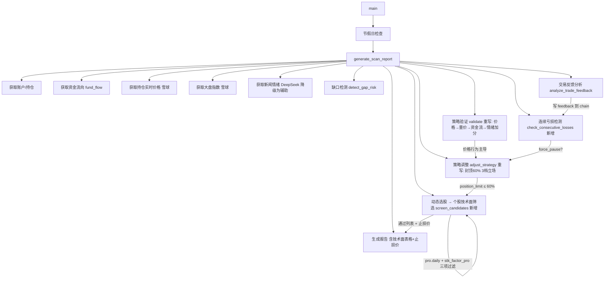

## 产品概述

将 `jobs/market_scan.py` 从"情绪优先覆盖技术面"的左侧交易逻辑，全面改造为"价格行为驱动"的右侧交易逻辑，对齐 Marcus 量化交易纪律。

## 核心功能

- **个股技术面筛选**：利用 tushare `pro.daily()` 获取日K线（手动计算 MA5/MA10/MA20），配合 `pro.stk_factor_pro()` 获取 MACD/RSI/BOLL 技术指标，对候选股逐只检查三项：价格站稳 5 日均线、MACD 金叉或柱状图为正、成交量突破 5 日均量 1.5 倍。三项全过才入选最终 watchlist。同时为每只通过筛选的股票计算止损价位（取近 20 日最低价下浮 1% 与当前价下浮 7% 的较小值）。

- **连续亏损强制休息**：在 `analyze_trade_feedback()` 分析完交易盈亏后，新增 `check_consecutive_losses()` 从策略链逆序遍历最近交易，统计连续亏损笔数。达到 3 笔连续亏损时设置 `force_pause=True`，阻止本次扫描的入场决策。

- **仓位硬封顶 60%**：将 `adjust_strategy()` 中所有 `80` 硬编码值替换为 `60`。position_limit 在任何路径下均不得超过 60%，严守 Marcus 单日仓位铁律。

- **决策链重构**：删除"情绪 score >= 70 + 有热点行业 → 跳过技术面强制做多"的核心逻辑。新决策优先级为：价格行为确认（指数/个股站稳 5 日线 + MACD 金叉）→ 量价配合（放量确认）→ 资金流确认（±5%调整）→ 情绪辅助加分（+5%，不主导方向）。

- **立场简化为 3 档**：aggressive（position_limit 50-60%）、cautious（30-40%）、hold（≤20%）。去除原有的 reduce 和 cut_loss 两个易混淆档位。

- **报告输出增强**：Markdown 报告中新增「技术面扫描」表格（代码/名称/5 日线位置/MACD 方向/量比/建议止损价），以及出现连续亏损时的「连续亏损暂停」警告区块。

## 技术栈

- Python 3（现有项目语言）
- tushare 1.4+：`pro.daily(ts_code, start_date, end_date)` 获取日K线（返回 open/high/low/close/pre_close/change/pct_chg/vol/amount，不含均线，需手动从 close 序列计算 MA5/MA10/MA20）；`pro.stk_factor_pro(ts_code, start_date, end_date)` 获取 MACD/DIF/DEA/KDJ/RSI6/12/24/BOLL/ATR/CCI 等 60+ 技术指标
- 雪球引擎 `XueqiuEngine.get_stock_quote(code, use_cache=False)`（已在用，获取实时行情）
- `StrategyChain` 策略链管理器（已在用，提供 trades/feedback_loop 状态读写）
- `core/_api_config.py`（已修复 load_dotenv，TUSHARE_TOKEN 从 .env 读取）

## 实现方法

### 整体策略

在现有 `market_scan.py` 上做就地重构，不新建文件。新增 4 个函数（`get_daily_kline`、`get_technical_indicators`、`screen_candidates_technically`、`check_consecutive_losses`），重写 2 个函数（`validate_pre_market_strategy`、`adjust_strategy`），修改 1 个主流程函数（`generate_scan_report`）。保持已有的缺口检测、节假日检查、资金流分析、持仓新闻分析等功能不变。

### 关键技术决策

**1. 日K线数据获取：`pro.daily()` + 手动计算均线**

`ts.pro_bar()` 不可用，改用 `pro.daily(ts_code, start_date, end_date)`。该接口返回 OHLCV 原始数据但不含均线。在 `get_daily_kline()` 函数中，获取近 30 个交易日的 close 序列，用 pandas rolling 计算 MA5/MA10/MA20，并计算近 5 日平均成交量作为放量判断基准。

ts_code 格式转换：复用 `core/stock_pool_manager.py` 中已有的规则——6 开头加 `.SH`，0/3 开头加 `.SZ`。token 获取：`from core._api_config import get_tushare_pro; pro = get_tushare_pro()`。

参考实现：`backend/app/api/market.py` L339-L403 的 `get_stock_kline()` 函数。

**2. 技术指标获取：`pro.stk_factor_pro()`**

该接口直接返回 MACD DIF/DEA、MACD 柱、RSI6/12/24、BOLL 上中下轨等指标，无需自行计算。取最近一个交易日的数据作为当前技术面状态。

参考实现：`backend/app/api/market.py` L517-L603 的 `get_stock_technical()` 函数。

**3. 个股筛选：三项全过的硬过滤**

```
条件1: latest_close > ma5（价格站稳 5 日均线）
条件2: macd_dif > macd_dea OR macd_hist > 0（MACD 金叉或柱状图为正）
条件3: latest_vol > avg_vol_5 * 1.5（成交量突破 5 日均量 50% 以上）
```

只有三项全过的股票才能进入最终 watchlist。不再使用纯情绪驱动的动态选股。

**4. 止损价计算**

从日K线近 20 个交易日取最低价作为"前低参考"：`stop_loss = min(near_20_low * 0.99, latest_close * 0.93)`，取更保守的值。

**5. 连续亏损检测**

`analyze_trade_feedback()` 执行完后立即调用 `check_consecutive_losses(chain)`。从 `chain.state['trades']` 逆序遍历，`trade.feedback.current_pnl < 0` 即为亏损。连续计数直到遇到盈利交易或遍历完。连续亏损 >= 3 返回 `force_pause=True`，在 `generate_scan_report()` 中阻止新交易入场并在报告中输出警告。

**6. 仓位封顶 60% 的具体改动位置**

| 位置 | 原值 | 改为 |
| --- | --- | --- |
| L301 `position_limit = 80` | 80 | 60 |
| L310 `min(position_limit + 20, 80)` | 80 | 60 |
| L416 `min(position_limit + 10, 80)` | 80 | 60 |
| L987 `目标仓位 80%` | 80 | 60 |


**7. validate_pre_market_strategy 重写逻辑**

删除 L141-157（情绪优先 + 技术覆盖），删除 L165-177（情绪驱动的调整判断）。新逻辑：

- 技术面确认（权重 40%）：至少 2 个指数涨幅 > 0.5% 且各自站稳 MA5（从日K线验证）
- 量价配合确认（权重 28%）：指数成交量是否放大
- 资金流确认（权重 16%）：fund_flow 信号
- 情绪加分（权重 12%，仅 +5% position_limit）：sentiment_score >= 60 加 5%，不改变方向判断

### 性能注意事项

- tushare API 有频率限制。`get_daily_kline()` 对候选股逐只调用 `pro.daily()`（单次调用获取 30 天数据），`get_technical_indicators()` 逐只调用 `pro.stk_factor_pro()`。每次扫描限制候选股 top 10，避免 API 过载。
- 日K线数据在同一个扫描周期内可复用：`get_daily_kline()` 的结果同时用于 MA 计算和止损价计算。
- 所有 tushare 调用需 try/except 包裹，失败时降级为空结果而非崩溃。

## 架构设计

### 修改后的数据流



### 函数变更清单

| 函数 | 变更类型 | 说明 |
| --- | --- | --- |
| `get_daily_kline(symbol, days=30)` | **新增** | 用 `pro.daily()` 获取日K线，手动计算 MA5/MA10/MA20/avg_vol_5，返回 dict 含 ohlcv/ma/vol 等字段 |
| `get_technical_indicators(symbol)` | **新增** | 用 `pro.stk_factor_pro()` 获取最近一日 MACD DIF/DEA/hist、RSI6、BOLL 等，返回 dict |
| `screen_candidates_technically(candidates)` | **新增** | 对候选股逐只调用上述两函数，执行三项硬过滤，计算止损价，返回 (passed_list, failed_list, stop_loss_map) |
| `check_consecutive_losses(chain)` | **新增** | 从 chain.state.trades 逆序统计连续 current_pnl < 0 的交易数，>= 3 返回 force_pause=True |
| `validate_pre_market_strategy()` | **重写** | 删除 L141-157 情绪优先逻辑和 L165-177 情绪驱动调整；改为价格行为确认主导，情绪仅 +5% 加分 |
| `analyze_trade_feedback()` | **保持** | 不修改 |
| `adjust_strategy()` | **重写** | 删除 L298-304 sentiment_hot_confirm 分支；所有 80 改为 60；立场从 5 档简化为 3 档（aggressive/cautious/hold）；资金流调整幅度缩小 |
| `get_market_status()` | **保持** | 不修改 |
| `generate_scan_report()` | **修改** | 选股环节集成 `screen_candidates_technically()`；报告新增技术面扫描表格和连续亏损警告；"目标仓位 80%"改为 60% |


## 目录结构

```
F:\pythonProject\AITrade\marcus-platform\jobs\
└── market_scan.py          # [MODIFY] 就地重构，新增 4 个函数 + 重写 2 个函数 + 修改 1 个函数
                              - 新增: get_daily_kline(), get_technical_indicators()
                              - 新增: screen_candidates_technically(), check_consecutive_losses()
                              - 重写: validate_pre_market_strategy(), adjust_strategy()
                              - 修改: generate_scan_report()（集成新函数 + 更新报告格式）
```