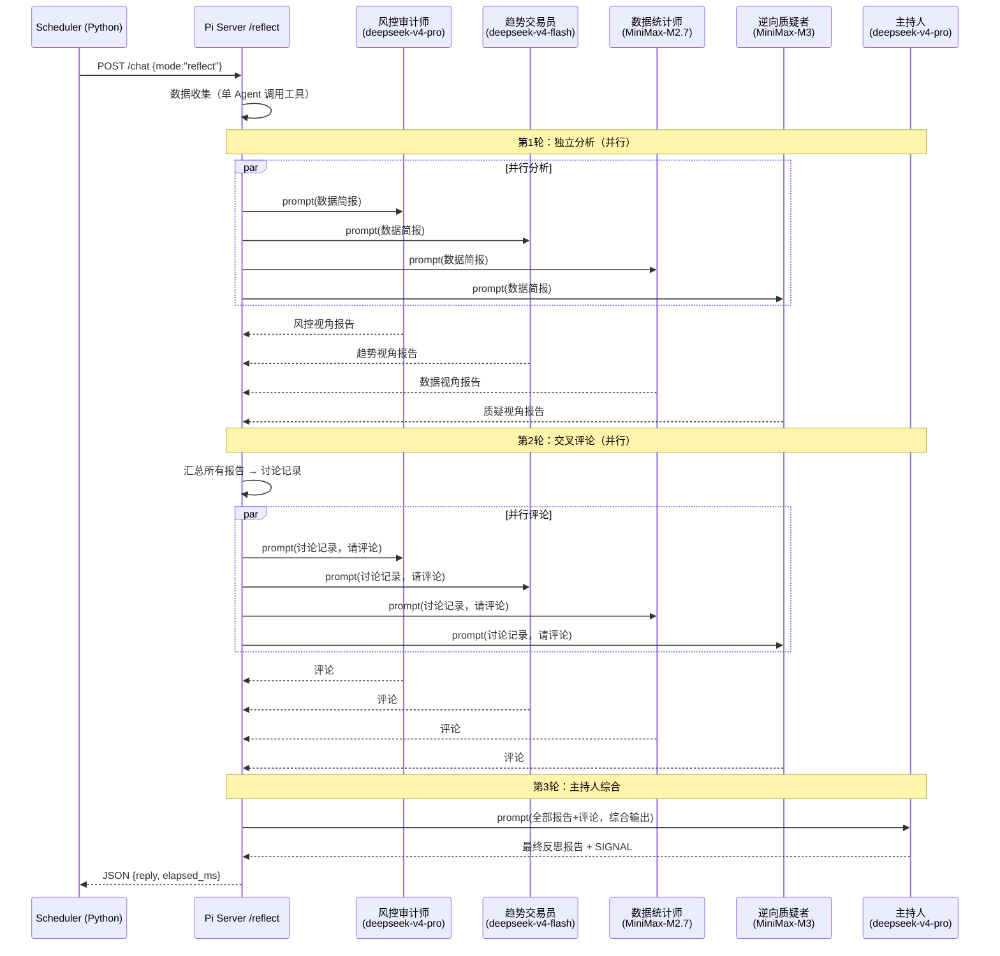

## 产品概述

将 Marcus 平台的反思模式从单一 AI 对话改为专家组群聊讨论。5 位不同性格的右侧交易专家，使用不同的大模型，通过 3 轮结构化讨论产出更全面、更少盲点的周度反思报告。

## 核心功能

- **5 位专家角色**：风控审计师（保守、吹毛求疵）、趋势交易员（激进、右侧信仰）、数据统计师（量化、客观）、逆向质疑者（找盲点、抬杠）、主持人（综合、平衡）
- **多模型混用**：deepseek-v4-pro（风控审计师 + 主持人）、deepseek-v4-flash（趋势交易员）、MiniMax-M2.7（数据统计师）、MiniMax-M3（逆向质疑者）
- **3 轮讨论流程**：第 1 轮所有专家并行独立分析 → 第 2 轮每位专家对他人观点发表评论 → 第 3 轮主持人综合产出最终报告
- **MiniMax 接入**：在 .env 中新增 MINIMAX_API_KEY，M2.7 用内置 minimax provider，M3 通过自定义 Model 对象接入
- **调度器适配**：超时从 300s 增加到 600s，适应多 Agent 并行+串行讨论耗时

## 技术栈

- 运行环境：Node.js (TypeScript) — pi-server 服务层；Python 3 — scheduler 调度层
- 核心依赖：@earendil-works/pi-agent-core (Agent 类)、@earendil-works/pi-ai (getModel, Model 类型)
- 模型提供者：deepseek (openai-completions API)、minimax (anthropic-messages API)
- 新增配置：MINIMAX_API_KEY 环境变量

## 实现方案

### 整体策略

不对现有 `/chat` 端点架构做破坏性修改。在 `index.ts` 中新增 `executePanelDiscussion()` 函数作为 reflect 模式专用的编排器。当 mode 为 "reflect" 时，跳过原有的 `getOrCreateAgent` + `agent.prompt()` 单 Agent 流程，改为启动专家组讨论。

### 3 轮讨论编排流程



### 关键设计决策

1. **数据收集独立于讨论**：先用一个轻量 Agent（deepseek-v4-flash + reflectTools）完成工具调用和数据收集，将结果整理为结构化"数据简报"，避免 5 个 Agent 各自重复调用工具（5 × N 次 API 调用 → 1 次）。

2. **并行度控制**：第 1 轮和第 2 轮内部使用 `Promise.all()` 并行执行，第 3 轮依赖前两轮结果必须串行。总耗时估算：数据收集 ~60s + 第1轮(最慢Agent) ~120s + 第2轮 ~120s + 第3轮 ~120s ≈ 7 分钟。调度器超时从 300s 提升到 600s。

3. **MiniMax-M3 自定义 Model**：由于 M3 未在 pi-ai 的 MODELS 注册表中，构造自定义 `Model<"anthropic-messages">` 对象，基于 M2.7 结构（baseUrl `https://api.minimax.chat/v1`，provider `minimax`），修改 id/name 为 `MiniMax-M3`。

4. **Agent 不复用会话缓存**：专家组 Agent 为临时对象，不存入 sessions Map，讨论完成后立即释放。每个 Agent 使用独立的 `sessionId`（如 `reflect_panel_风控审计师_20260612`）。

5. **旧 REFLECT_SYSTEM_PROMPT 降级为 Moderator 的 system prompt**，其余 4 位专家使用全新编写的角色 prompt。

## 目录结构

```
marcus-platform/
├── .env                                    # [MODIFY] 新增 MINIMAX_API_KEY=
├── servers/pi-server/src/
│   └── index.ts                            # [MODIFY] 核心改动文件
│       ├── 行 47-49: 新增 MINIMAX_API_KEY 读取
│       ├── 行 513-640: 旧 REFLECT_SYSTEM_PROMPT 替换为 5 个专家 prompt
│       ├── 行 659: 移除或注释 REFLECT_MODEL
│       ├── 行 670-671: 修改 getModeConfig，reflect 返回占位配置
│       ├── 行 686-718: 修改 getOrCreateAgent，reflect 不走该路径
│       ├── 行 816-875: /chat 端点，reflect 模式分流到 panel discussion
│       ├── 新增: executePanelDiscussion() 函数 (~200行)
│       ├── 新增: buildMinimaxM3Model() 函数 (~20行)
│       ├── 新增: createPanelAgent() 工厂函数 (~20行)
│       ├── 新增: 5 个 PANEL_MEMBERS 常量定义
│       └── 行 881-891: 更新启动日志
└── backend/app/services/
    └── scheduler_service.py                # [MODIFY] 超时调整
        └── 行 1127: timeout=300 → timeout=600
```

## 关键代码结构

### PanelMember 类型定义（index.ts 新增）

```typescript
interface PanelMember {
  role: string;
  roleLabel: string;
  provider: 'deepseek' | 'minimax';
  modelId: string;
  model?: Model<any>;           // 自定义模型时使用
  thinkingLevel: ThinkingLevel;
  systemPrompt: string;
  apiKey: string;
}

const PANEL_MEMBERS: PanelMember[] = [
  { role: 'risk_controller', roleLabel: '风控审计师', provider: 'deepseek', modelId: 'deepseek-v4-pro', thinkingLevel: 'high', ... },
  { role: 'trend_trader', roleLabel: '趋势交易员', provider: 'deepseek', modelId: 'deepseek-v4-flash', thinkingLevel: 'medium', ... },
  { role: 'data_analyst', roleLabel: '数据统计师', provider: 'minimax', modelId: 'MiniMax-M2.7', thinkingLevel: 'medium', ... },
  { role: 'devils_advocate', roleLabel: '逆向质疑者', model: buildMinimaxM3Model(), thinkingLevel: 'medium', ... },
  { role: 'moderator', roleLabel: '主持人', provider: 'deepseek', modelId: 'deepseek-v4-pro', thinkingLevel: 'high', ... },
];
```

### executePanelDiscussion 函数签名（index.ts 新增）

```typescript
async function executePanelDiscussion(
  message: string,
  sessionId: string
): Promise<{ reply: string; elapsed_ms: number }>
```

### buildMinimaxM3Model 函数（index.ts 新增）

```typescript
function buildMinimaxM3Model(): Model<"anthropic-messages"> {
  // 基于 M2.7 结构手工构造，id/name 改为 MiniMax-M3
  return {
    id: "MiniMax-M3",
    name: "MiniMax-M3",
    api: "anthropic-messages" as const,
    provider: "minimax",
    baseUrl: "https://api.minimax.chat/v1",
    reasoning: true,
    input: ["text"],
    cost: { input: 0, output: 0, cacheRead: 0, cacheWrite: 0 },
    contextWindow: 200000,
    maxTokens: 8192,
  };
}
```

## 使用的 Agent 扩展

### SubAgent

- **code-explorer**
- 用途：深入探索 pi-ai 包中 minimax provider 的完整 Model 定义、Agent 构造参数、Tool 接口类型，确保自定义 M3 Model 和 Panel Agent 创建的准确性
- 预期结果：获取 MiniMax-M2.7 的完整字段值（baseUrl、reasoning、thinkingLevelMap、contextWindow、maxTokens 等），以及 Agent 构造函数的完整类型签名

### Skill

- **skill-creator**
- 用途：如果需要将 Panel Discussion 逻辑封装为可复用的 skill，用于指导创建
- 预期结果：（备用，不强制使用）